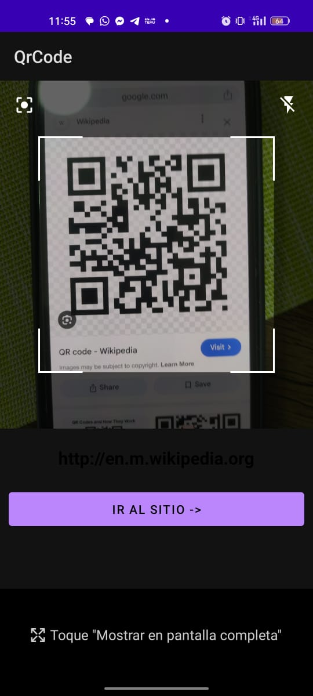

# qr-code-android-app [OLD PROJECTS]
In 2021 I built a qr-code android native app to provide my mom a quick way to scan qr menus at restaurants

## Views

Check below the views of the app

## About

In 2021 I built an android native application, aims to provide a quick way to scan qr menus at restaurants. You should probably think about tools like google lens already provides this service, but my mother has some issues using tools like this, therefore I create this for her.

I used to don't share my code at all, now I wanna create a collection with old projects and share them with the community as a way to show my progress and how I've evolved as a developer.

The app is built using Kotlin and Android Studio. The app is not published on the Google Play Store, but you can clone the repository and build the app yourself.